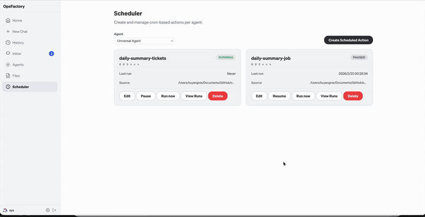
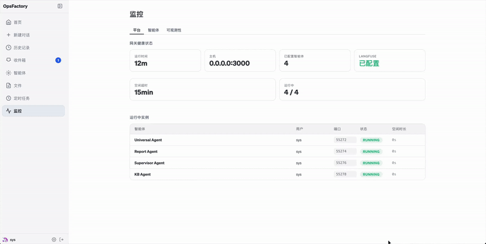
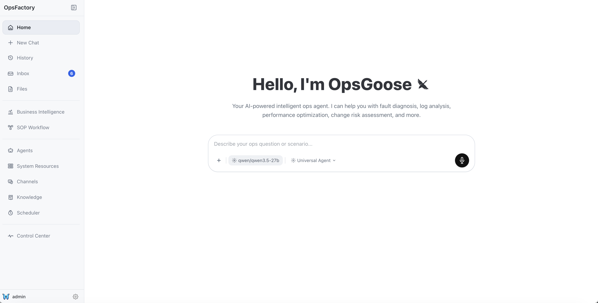
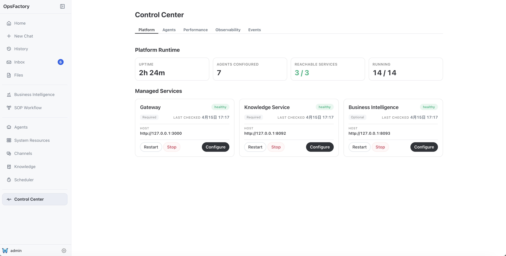
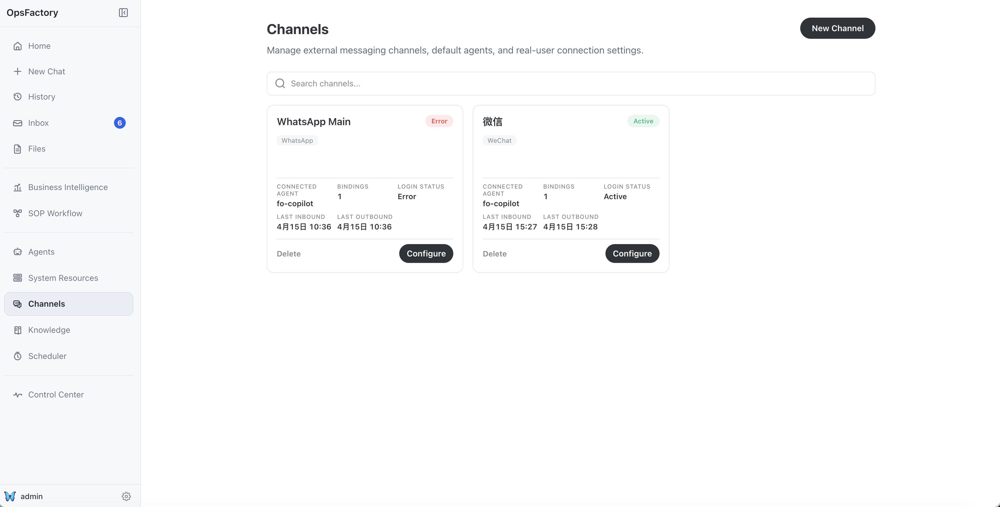
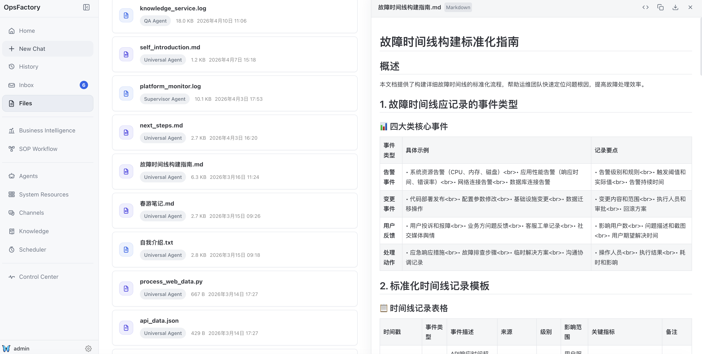
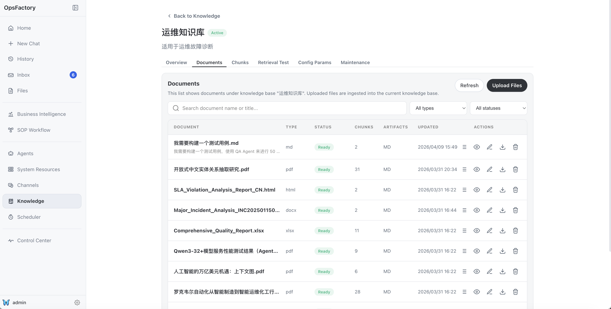
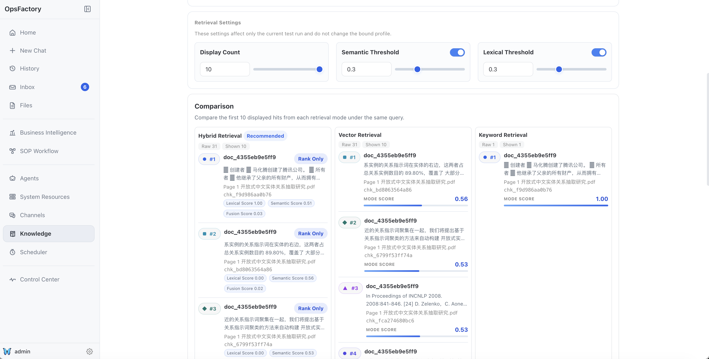

# Ops Factory

A multi-tenant AI agent management platform built on [Goose](https://github.com/block/goose). Ops Factory provides a unified web interface for managing multiple AI agents that collaborate on operations tasks such as incident analysis, knowledge retrieval, and report generation.

## Demo Media

### GIF Demos

### 1. Universal Agent Planning


### 2. Visualization & Chart


### 3. Artifacts Preview


### 4. Scheduler



### 5. Monitoring & Observation


### 6. KB Agent (Feishu)


### 7. Self-Supervisor Agent



### UI Screenshots

#### Home



#### Control Center



#### Channels



#### Files Preview



#### Knowledge Docs



#### Knowledge Recall Testing



## Architecture

```text
Web App (React/Vite :5173)
    |
    |  x-secret-key / x-user-id
    v
Gateway (Node.js :3000)
    |
    +-- InstanceManager: spawns goosed processes per user on dynamic ports
    |     +-- "admin" instances (always running, handles schedules)
    |     +-- per-user instances (spawned on demand, idle-reaped after 15 min)
    |
    +-- Routes: /agents/:id/agent/* -> proxy to user's goosed instance
    +-- Routes: /agents/:id/sessions/* -> session management
    +-- Routes: /agents/:id/files/* -> file serving
    +-- Routes: /agents/:id/config -> agent config CRUD
```

See [docs/architecture/overview.md](./docs/architecture/overview.md) for the architecture overview and [docs/README.md](./docs/README.md) for the full documentation map.

## Documentation

Use these documents as the main entry points for collaboration:

- [AGENTS.md](./AGENTS.md): short contributor rules and cross-team constraints
- [docs/README.md](./docs/README.md): documentation map
- [docs/architecture/overview.md](./docs/architecture/overview.md): system boundaries and module responsibilities
- [docs/development/review-checklist.md](./docs/development/review-checklist.md): pull request and review checklist

## Components

| Component | Directory | Port | Description |
|-----------|-----------|------|-------------|
| Gateway | `gateway/` | 3000 | Node.js HTTP server managing per-user agent instances, proxying, and routing |
| Web App | `web-app/` | 5173 | React frontend for chat, session management, file browsing, and agent configuration |
| TypeScript SDK | `typescript-sdk/` | — | Client library (`@goosed/sdk`) for programmatic access to the Goose API |
| Agents | `agents/` | — | Pre-configured AI agents (universal, kb, report) with YAML configs and skills |
| Prometheus Exporter | `prometheus-exporter/` | 9091 | Spring Boot exporter exposing gateway monitoring metrics for Prometheus |
| Prometheus Exporter (Legacy) | `prometheus-exporter-legacy/` | 9091 | Legacy Node.js/TypeScript exporter kept for rollback reference |
| Langfuse | `langfuse/` | 3100 | LLM observability platform (Docker Compose) |
| OnlyOffice | — | 8080 | Office document preview server (Docker) |

## Quick Start

### Prerequisites

- Node.js 18+
- [goosed](https://github.com/block/goose) binary installed and on PATH
- Docker (for OnlyOffice and Langfuse)

### Start All Services

```bash
./scripts/ctl.sh startup
```

This starts OnlyOffice, Langfuse, Gateway, and Web App in order. The web app is available at `http://127.0.0.1:5173`.

To pass a gateway API password through the orchestrator (defaults to empty):

```bash
./scripts/ctl.sh startup --apipwd mypass
```

### Start Individual Components

```bash
./scripts/ctl.sh startup gateway    # Start gateway only
./scripts/ctl.sh startup webapp     # Start web app only
./scripts/ctl.sh shutdown all       # Stop all services
./scripts/ctl.sh status             # Check service status
./scripts/ctl.sh restart gateway    # Restart gateway
```

### Manual Setup

```bash
# 1. Gateway
cd gateway && npm install && npm run dev

# 2. Web App (in another terminal)
cd web-app && npm install && npm run dev

# 3. Open http://127.0.0.1:5173
```

## TypeScript SDK

```bash
cd typescript-sdk && npm install && npm run build
```

```typescript
import { GoosedClient } from '@goosed/sdk';

const client = new GoosedClient({
  baseUrl: 'http://127.0.0.1:3000/agents/universal-agent',
  secretKey: 'test',
  userId: 'alice',
});

// Start a session and chat
const session = await client.startSession('/path/to/workdir');
const reply = await client.chat(session.id, 'Hello!');
console.log(reply);

// Streaming
for await (const event of client.sendMessage(session.id, 'Explain this code')) {
  if (event.type === 'Message') {
    console.log(event.message);
  }
}
```

## Testing

```bash
cd test
npm install
npm test                  # Vitest integration tests
npm run test:e2e          # Playwright E2E tests (requires running app)
npm run test:e2e:headed   # E2E with visible browser
```

## Configuration

Every component uses a unified configuration approach:

```text
config.yaml  →  environment variable override  →  error if required field missing
```

Each component has its own `config.yaml` in its directory. Copy the corresponding `config.yaml.example` to `config.yaml` and edit as needed. Environment variables always take priority over `config.yaml` values.

### Gateway (`gateway/config.yaml`)

| Field | Env Var | Default | Required |
| ----- | ------- | ------- | -------- |
| `server.host` | `GATEWAY_HOST` | `0.0.0.0` | |
| `server.port` | `GATEWAY_PORT` | `3000` | |
| `server.secretKey` | `GATEWAY_SECRET_KEY` | — | **Yes** |
| `server.corsOrigin` | `CORS_ORIGIN` | `*` | |
| `tls.cert` | `TLS_CERT` | — | |
| `tls.key` | `TLS_KEY` | — | |
| `paths.projectRoot` | `PROJECT_ROOT` | auto-detected | |
| `paths.agentsDir` | `AGENTS_DIR` | `<projectRoot>/gateway/agents` | |
| `paths.usersDir` | `USERS_DIR` | `<projectRoot>/gateway/users` | |
| `paths.goosedBin` | `GOOSED_BIN` | `goosed` | |
| `idle.timeoutMinutes` | `IDLE_TIMEOUT_MS` (ms) | `15` | |
| `idle.checkIntervalMs` | `IDLE_CHECK_INTERVAL_MS` | `60000` | |
| `upload.maxFileSizeMb` | `MAX_UPLOAD_FILE_SIZE_MB` | `10` | |
| `upload.maxImageSizeMb` | `MAX_UPLOAD_IMAGE_SIZE_MB` | `5` | |
| `upload.retentionHours` | `UPLOAD_RETENTION_HOURS` | `24` | |
| `officePreview.enabled` | `OFFICE_PREVIEW_ENABLED` | `false` | |
| `officePreview.onlyofficeUrl` | `ONLYOFFICE_URL` | `http://localhost:8080` | |
| `officePreview.fileBaseUrl` | `ONLYOFFICE_FILE_BASE_URL` | `http://host.docker.internal:3000` | |
| `vision.mode` | `VISION_MODE` | `passthrough` | |
| `langfuse.host` | `LANGFUSE_HOST` | — | |
| `langfuse.publicKey` | `LANGFUSE_PUBLIC_KEY` | — | |
| `langfuse.secretKey` | `LANGFUSE_SECRET_KEY` | — | |

Agent-specific configuration (LLM provider, model, extensions) remains in `gateway/agents/{id}/config/config.yaml`.

### Web App (`web-app/config.yaml`)

| Field | Env Var | Default | Required |
| ----- | ------- | ------- | -------- |
| `gatewayUrl` | `GATEWAY_URL` | — | **Yes** |
| `gatewaySecretKey` | `GATEWAY_SECRET_KEY` | — | **Yes** |
| `knowledgeServiceUrl` | `KNOWLEDGE_SERVICE_URL` | `http://127.0.0.1:8092` | |
| `port` | `VITE_PORT` | `5173` | |

### Prometheus Exporter (`prometheus-exporter/config.yaml`)

| Field | Env Var | Default | Required |
| ----- | ------- | ------- | -------- |
| `port` | `EXPORTER_PORT` | `9091` | |
| `gatewayUrl` | `GATEWAY_URL` | — | **Yes** |
| `gatewaySecretKey` | `GATEWAY_SECRET_KEY` | — | **Yes** |
| `collectTimeoutMs` | `COLLECT_TIMEOUT_MS` | `5000` | |

> Legacy implementation has been moved to `prometheus-exporter-legacy/`.

### Langfuse (`langfuse/config.yaml`)

All fields are optional with defaults for local development. The `ctl.sh` script reads `config.yaml` and generates a `.env` file consumed by Docker Compose.

| Field | Env Var | Default |
| ----- | ------- | ------- |
| `port` | `LANGFUSE_PORT` | `3100` |
| `postgres.db` | `POSTGRES_DB` | `langfuse` |
| `postgres.user` | `POSTGRES_USER` | `langfuse` |
| `postgres.password` | `POSTGRES_PASSWORD` | `langfuse` |
| `postgres.port` | `POSTGRES_PORT` | `5432` |
| `nextauthSecret` | `NEXTAUTH_SECRET` | — |
| `salt` | `SALT` | — |
| `telemetryEnabled` | `TELEMETRY_ENABLED` | `false` |
| `init.*` | `LANGFUSE_INIT_*` | see `config.yaml.example` |

### OnlyOffice (`onlyoffice/config.yaml`)

All fields are optional. The `ctl.sh` script reads `config.yaml` and generates a `.env` file consumed by Docker Compose.

| Field | Env Var | Default |
| ----- | ------- | ------- |
| `port` | `ONLYOFFICE_PORT` | `8080` |
| `jwtEnabled` | `JWT_ENABLED` | `false` |
| `pluginsEnabled` | `PLUGINS_ENABLED` | `false` |
| `allowPrivateIpAddress` | `ALLOW_PRIVATE_IP_ADDRESS` | `true` |
| `allowMetaIpAddress` | `ALLOW_META_IP_ADDRESS` | `true` |

## Project Structure

```text
ops-factory/
├── gateway/           # Node.js HTTP gateway
├── web-app/           # React frontend
├── typescript-sdk/    # @goosed/sdk client library
├── agents/            # Agent configurations (YAML + skills)
├── langfuse/          # Langfuse Docker Compose
├── prometheus-exporter/ # Spring Boot Prometheus exporter
├── prometheus-exporter-legacy/ # Legacy Node.js exporter
├── scripts/           # Service management (ctl.sh)
├── test/              # Integration and E2E tests
├── docs/              # Architecture documentation
└── users/             # Per-user runtime directories (auto-generated)
```

---

## Linux Deployment Guide

以下指南帮助你在 Linux 服务器上部署 Ops Factory Gateway 及其所有依赖。

### 1. 系统依赖

```bash
# Node.js 18+
curl -fsSL https://deb.nodesource.com/setup_18.x | sudo -E bash -
sudo apt-get install -y nodejs

# Java 17+ (Gateway 后端)
sudo apt-get install -y openjdk-17-jdk maven

# Git
sudo apt-get install -y git
```

### 2. goosed 二进制

Gateway 通过 `goosed` 启动 Agent 实例。确保二进制文件在 PATH 中：

```bash
# 从 goose 项目获取 goosed 二进制，放到 /usr/local/bin/
sudo cp goosed /usr/local/bin/goosed
sudo chmod +x /usr/local/bin/goosed
goosed --version  # 验证
```

### 3. Google Chrome（浏览器自动化 MCP 依赖）

QoS Agent 的 SOP 浏览器节点通过 Puppeteer 控制本机 Chrome 执行 Web 操作。

```bash
# 添加 Google Chrome 官方源
wget -q -O - https://dl.google.com/linux/linux_signing_key.pub | sudo apt-key add -
echo "deb [arch=amd64] http://dl.google.com/linux/chrome/deb/ stable main" | sudo tee /etc/apt/sources.list.d/google-chrome.list
sudo apt-get update
sudo apt-get install -y google-chrome-stable

# 验证安装
google-chrome --version

# headless 模式无需 X Server，但如果需要 headed 模式调试：
# sudo apt-get install -y xvfb
# xvfb-run google-chrome --no-sandbox ...
```

> **国内服务器替代方案**：如果无法访问 Google 官方源，可用 Chromium 替代：
> ```bash
> sudo apt-get install -y chromium-browser
> ```
> 然后在 `config.yaml` 中设置环境变量 `CHROME_PATH: "/usr/bin/chromium-browser"`。

### 4. MCP Server 依赖安装

QoS Agent 有两个 stdio 类型 MCP Server，需要预装 npm 依赖：

```bash
PROJECT_ROOT=/path/to/ops-factory-main

# 4.1 browser-use MCP Server（浏览器自动化，基于 Puppeteer）
cd $PROJECT_ROOT/gateway/agents/qos-agent/config/mcp/browser-use
PUPPETEER_SKIP_DOWNLOAD=true npm install

# 4.2 sop-executor MCP Server（远程命令执行）
cd $PROJECT_ROOT/gateway/agents/qos-agent/config/mcp/sop-executor
npm install
npx tsc   # 编译 TypeScript
```

> **注意**：browser-use MCP Server 使用系统安装的 Google Chrome，不需要 Puppeteer 下载 Chromium，因此安装时必须设置 `PUPPETEER_SKIP_DOWNLOAD=true`。

### 5. Gateway 配置

```bash
cd $PROJECT_ROOT/gateway

# 安装依赖
npm install

# 编译 Java 后端（如有）
mvn package -DskipTests

# 创建配置
cp config.yaml.example config.yaml
```

#### 5.1 关键配置项 (`config.yaml`)

确保以下配置适配 Linux 环境：

```yaml
# Gateway 服务端
server:
  host: 0.0.0.0
  port: 3000
  secretKey: your-secret-key

# Chrome 路径（如果使用 Chromium 而非 Chrome）
# 在 browser-use MCP 扩展的 envs 中设置：
#   CHROME_PATH: "/usr/bin/chromium-browser"
```

#### 5.2 Agent 配置 (QoS Agent)

QoS Agent 配置文件位于 `gateway/agents/qos-agent/config/config.yaml`。

**浏览器 MCP Server 配置**：
```yaml
extensions:
  browser-use:
    enabled: true
    type: stdio
    name: browser-use
    cmd: npx
    args:
    - tsx
    - config/mcp/browser-use/src/index.ts
    envs:
      CHROME_PATH: "/usr/bin/google-chrome"   # Linux Chrome 路径
    timeout: 60
```

**LLM 配置**（通过 `secrets.yaml`，不提交到 Git）：
```bash
cp gateway/agents/qos-agent/config/secrets.yaml.sample secrets.yaml
# 编辑 secrets.yaml 填入实际的 API Key
```

#### 5.3 前端配置

```bash
cd $PROJECT_ROOT/web-app
npm install

# Mermaid 图表渲染库已包含在 npm 依赖中，无需额外安装

# 配置 Gateway 地址
# 在 config.yaml 中设置 gatewayUrl 指向实际的 Gateway 地址
```

> **注意**：前端 Mermaid 流程图渲染使用本地文件（`web-app/public/mermaid/mermaid.min.js`），不依赖外部 CDN，无需联网即可渲染。

### 6. 启动服务

```bash
cd $PROJECT_ROOT

# 启动所有服务
./scripts/ctl.sh startup

# 或单独启动
./scripts/ctl.sh startup gateway
./scripts/ctl.sh startup webapp
```

### 7. 依赖清单速查

| 依赖 | 用途 | 安装方式 | 验证命令 |
|------|------|---------|---------|
| Node.js 18+ | Gateway / Web App / MCP Servers | nodesource | `node --version` |
| Java 17+ | Gateway 后端 | apt | `java --version` |
| Maven | Java 构建 | apt | `mvn --version` |
| goosed | Agent 实例管理 | 手动安装 | `goosed --version` |
| Google Chrome / Chromium | 浏览器自动化 MCP | apt | `google-chrome --version` |
| Docker | OnlyOffice / Langfuse | apt | `docker --version` |
| npm (tsx) | 运行 MCP TypeScript | 随 Node.js | `npx tsx --version` |
| mermaid@10 (npm) | 前端流程图渲染（本地文件） | npm install | 检查 `web-app/public/mermaid/mermaid.min.js` 存在 |

### 8. 环境变量速查

| 变量 | 作用 | 默认值 |
|------|------|--------|
| `CHROME_PATH` | Chrome/Chromium 可执行文件路径 | 自动检测（Win: `%LOCALAPPDATA%\Google\Chrome\Application\chrome.exe`，Linux: `/usr/bin/google-chrome`） |
| `GATEWAY_URL` | Gateway 地址 | `http://127.0.0.1:3000` |
| `GATEWAY_SECRET_KEY` | Gateway 鉴权密钥 | 必填 |
| `OUTPUT_DIR` | 浏览器截图等输出目录 | `./output` |

### 9. 常见问题

**Q: Chrome 启动失败 `No usable sandbox`**
```bash
# 在 Linux 无 root 环境下需要 --no-sandbox
# MCP Server 已内置此参数，无需额外配置
```

**Q: puppeteer 找不到 Chrome**
```bash
# 检查 Chrome 是否安装
which google-chrome || which chromium-browser

# 如果路径不同，在 config.yaml 的 browser-use envs 中设置 CHROME_PATH
```

**Q: npm install 失败（puppeteer 下载 Chromium）**
```bash
# MCP Server 使用系统 Chrome，不需要 Puppeteer 下载 Chromium
# 设置环境变量跳过下载：
PUPPETEER_SKIP_DOWNLOAD=true npm install
```

**Q: Mermaid 流程图无法渲染**
```bash
# 检查本地 mermaid 文件是否存在
ls web-app/public/mermaid/mermaid.min.js

# 如果文件不存在，从 npm 依赖中复制：
cp web-app/node_modules/mermaid/dist/mermaid.min.js web-app/public/mermaid/mermaid.min.js
```
