# Channel 模块架构说明

## 1. 目标与边界

`channel` 模块负责把外部即时通信渠道接入到 `gateway`，再桥接到平台内部的 agent/session 体系。当前仓库已经落地的渠道类型只有：

- `whatsapp`
- `wechat`

该模块的核心职责是：

- 管理渠道实例配置、运行态和事件记录
- 管理外部会话与内部 session 的绑定关系
- 把外部入站消息转成内部 agent 对话输入
- 把 agent 输出转成渠道出站消息
- 管理二维码登录、登录态刷新、去重和基础排障信息

非目标和边界：

- 前端不能直接对接外部渠道 SDK 或第三方接口，仍然只能通过 `gateway`
- 当前 `whatsapp` 不是 Meta Cloud API 模式，而是 `WhatsApp Web + 本地 helper` 模式
- 当前 `wechat` 不是基于公网回调的 webhook 模式，而是 `二维码登录 + iLink 长轮询` 模式
- `ChannelWebhookController` 目前属于预留扩展入口；现有 `whatsapp` / `wechat` 实现都不依赖公网 webhook

## 2. 模块分层

### 2.1 管理面

- `ChannelAdminController`
  - 提供渠道的创建、更新、启停、删除、登录、登出、探测、绑定列表、事件列表、自测接口
- `ChannelConfigService`
  - 负责 `gateway/channels/*` 下的配置落盘、运行态合并、事件记录、渠道目录初始化

### 2.2 运行面

- `WhatsAppWebLoginService`
  - 管理 WhatsApp Web 登录流程，启动/停止 helper，维护 `login-state.json`
- `WeChatLoginService`
  - 管理 WeChat 二维码登录流程，启动/停止 helper，维护 `login-state.json`
- `WhatsAppMessagePumpService`
  - 定时扫描 WhatsApp `inbox/`，去重后投递到内部 session，再把回复写入 `outbox/pending/`
- `WeChatMessagePumpService`
  - 定时扫描 WeChat `inbox/`，流程与 WhatsApp 类似，但保留 `contextToken`

### 2.3 桥接层

- `ChannelBindingService`
  - 为外部会话生成稳定 binding，并创建 `syntheticUserId`
- `SessionBridgeService`
  - 负责启动或复用 agent runtime/session，把外部文本转成 `/reply` 调用，并从 SSE 中抽取最终可见回复
- `ChannelDedupService`
  - 基于 `externalMessageId` 做近 500 条去重，避免重复消费

### 2.4 helper 进程

- `gateway/tools/whatsapp-web-helper/index.js`
  - 基于 Baileys 维护 WhatsApp Web 登录、收消息、发消息
- `gateway/tools/wechat-helper/index.mjs`
  - 基于 iLink 接口获取二维码、确认登录、执行 `getupdates` 长轮询和 `sendmessage`

## 3. 目录与落盘契约

每个渠道实例使用目录：

`gateway/channels/<type>/<channelId>/`

典型文件如下：

- `config.json`
  - 渠道静态配置，包含 `defaultAgentId`、`ownerUserId`、`config.loginStatus` 等
- `bindings.json`
  - 外部会话与内部 session 绑定关系
- `events.json`
  - 最近事件流水，便于管理台展示和排障
- `inbound-dedup.json`
  - 最近消费过的外部消息 ID
- `login-state.json`
  - helper 写入的实时登录态快照，管理台优先读它来展示二维码、错误、最近连接时间
- `login.pid`
  - helper 进程 PID
- `login.log`
  - helper 标准输出/登录相关日志
- `inbox/`
  - helper 写入入站消息文件，message pump 轮询消费
- `inbox-processed/`
  - 已消费、重复、异常文件归档
- `outbox/pending/`
  - message pump 产出的待发送消息
- `outbox/sent/`
  - helper 已成功发送的消息
- `outbox/error/`
  - helper 发送失败的消息

对接时要注意：

- `config.json` 是静态配置基线
- `login-state.json` 是运行态真值来源
- `ChannelConfigService` 会在读渠道详情时把两者合并

## 4. 通用桥接流程

不论是 WhatsApp 还是 WeChat，消息桥接都遵循同一条主链路：

```mermaid
flowchart LR
    A["管理台创建渠道"] --> B["登录服务启动 helper"]
    B --> C["helper 接入外部渠道"]
    C --> D["helper 写入 inbox/*.json"]
    D --> E["MessagePump 定时扫描"]
    E --> F["ChannelDedupService 去重"]
    F --> G["ChannelBindingService 确认 binding"]
    G --> H["SessionBridgeService 启动或复用内部 session"]
    H --> I["调用 goosed /reply 并消费 SSE"]
    I --> J["生成最终回复文本"]
    J --> K["写入 outbox/pending/*.json"]
    K --> L["helper 发送到外部渠道"]
```

其中最关键的设计点有三个：

### 4.1 外部会话不会直接映射为真实平台用户

`ChannelBindingService` 会按以下维度生成稳定 binding：

- `channelId`
- `accountId`
- `conversationId`
- `threadId`

然后基于这些字段计算 `syntheticUserId`。这样做的目的有两个：

- 避免把外部手机号、微信 ID 直接当作平台真实用户
- 保证同一个外部会话能稳定复用同一个 agent runtime/session 语境

### 4.2 外部渠道消息最终仍然进入内部 agent session

`SessionBridgeService` 的做法不是自己实现一套问答逻辑，而是：

1. 先通过 `InstanceManager` 获取或拉起 `(agentId, syntheticUserId)` 对应 runtime
2. 调用 `/agent/start` 和 `/agent/resume` 获取/恢复 session
3. 调用 runtime 的 `/reply`
4. 消费 SSE 流，只提取 `assistant` 且 `userVisible != false` 的文本内容
5. 再把这段文本当成渠道回复发回去

这意味着：

- 外部渠道和 Web UI 最终共享同一套 agent 能力
- 渠道桥接层不需要理解模型细节，只关心输入输出

### 4.3 收发通过文件夹解耦

当前实现没有让 Java 服务直接持有 WhatsApp/WeChat SDK 连接，而是采用：

- helper 负责真实接入和协议细节
- gateway 负责编排、绑定、session 桥接
- 双方通过 `inbox/` 和 `outbox/` 文件夹交互

这样做的好处是：

- Java 主服务和第三方即时通信 SDK 隔离
- helper 异常退出时，问题范围更容易收敛
- 运行态排查可以直接看文件和日志

## 5. WhatsApp 对接流程

### 5.1 模式说明

当前 `whatsapp` 渠道采用 `WhatsApp Web` 模式，不是 Meta Cloud API，也不使用 webhook 校验。`WhatsAppAdapter` 对 webhook 请求会直接报错，说明当前模式下 webhook 入口只是为未来其他渠道保留。

### 5.2 登录流程

1. 管理台调用 `POST /gateway/channels/{channelId}/login`
2. `WhatsAppWebLoginService` 先做准备工作：
   - 校验渠道类型
   - 清理旧 PID 对应的 helper
   - 创建 `auth/`、`inbox/`、`outbox/` 等目录
   - 将 `config.loginStatus` 更新为 `pending`
   - 写入初始 `login-state.json`
3. 服务启动 `gateway/tools/whatsapp-web-helper/index.js`
4. helper 使用 Baileys 的 `useMultiFileAuthState(authDir)` 初始化登录态
5. 如果拿到 QR，helper 将二维码写入 `login-state.json.qrCodeDataUrl`
6. 用户在手机 WhatsApp 的 `Linked Devices` 中扫码
7. 连接打开后，helper 从 `sock.user.id` 解析出本机号码，回写：
   - `status=connected`
   - `selfPhone`
   - `lastConnectedAt`
8. 管理台通过 `GET /gateway/channels/{channelId}/login-state` 轮询读取状态并展示

关键点：

- 登录态保存在渠道私有 `auth/` 目录，而不是数据库
- 如果 Baileys 返回需要重启配对，helper 会自动重建 socket
- 如果出现 `loggedOut`，状态会变成 `disconnected`，需要重新扫码

### 5.3 入站消息流程

1. helper 监听 `messages.upsert`
2. 只处理文本消息：
   - `conversation`
   - `extendedTextMessage.text`
3. helper 将 JID 归一化成 E.164 风格手机号，如 `+86138...`
4. helper 把入站消息写成 `inbox/<messageId>.json`
5. `WhatsAppMessagePumpService` 每 2 秒扫描 `inbox/`
6. `ChannelDedupService` 基于 `messageId` 去重
7. `SessionBridgeService.sendConversationText(...)` 把文本送入内部 session
8. 如果 agent 有文本回复，pump 会写入 `outbox/pending/<uuid>.json`
9. 原始入站文件被移动到 `inbox-processed/`

入站文件核心字段：

- `messageId`
- `peerId`
- `conversationId`
- `text`
- `receivedAt`

当前实现里，`conversationId` 与 `peerId` 一致，意味着默认按单聊维度做会话绑定。

### 5.4 出站消息流程

1. pump 写入 `outbox/pending/`
2. helper 每 1.5 秒扫描待发送目录
3. helper 把 `to` 转成 `digits@s.whatsapp.net`
4. 调用 `sock.sendMessage(jid, { text })`
5. 成功后写入 `outbox/sent/`，失败写入 `outbox/error/`

为了避免自发消息再次被当作入站消息消费，helper 还会记录刚发送成功的 `waMessageId`，短时间内在 `messages.upsert` 中跳过这些消息。

### 5.5 自测流程

`WhatsAppMessagePumpService.runSelfTest(...)` 提供了一个特殊能力：

- 使用当前登录出的 `selfPhone` 作为收件人与会话 ID
- 通过和真实渠道相同的 session/outbox 链路完成一次自发自收

它的意义是：

- 验证 agent reply 链路是否可用
- 验证 outbox 到 WhatsApp 的发送链路是否可用

## 6. WeChat 对接流程

### 6.1 模式说明

当前 `wechat` 渠道也不是 webhook 模式，而是二维码登录后，helper 通过 iLink 接口长轮询消息。它与 WhatsApp 最大的区别是：

- 登录依赖二维码确认后返回的 `bot_token`
- 收消息依赖 `getupdates`
- 回消息依赖 `sendmessage`
- 会话上下文需要保留 `contextToken`

### 6.2 登录流程

1. 管理台调用 `POST /gateway/channels/{channelId}/login`
2. `WeChatLoginService` 创建运行目录并写入初始 `login-state.json`
3. 服务启动 `gateway/tools/wechat-helper/index.mjs`
4. helper 调用固定入口 `https://ilinkai.weixin.qq.com/ilink/bot/get_bot_qrcode`
5. helper 把二维码页面内容转成 `qrCodeDataUrl`，写回 `login-state.json`
6. 用户用微信扫码并确认授权
7. helper 持续轮询 `get_qrcode_status`
8. 轮询过程中会处理几种状态：
   - `wait`：继续等待
   - `scaned`：已扫码，等待手机端确认
   - `scaned_but_redirect`：切换到新的 `baseUrl`
   - `expired`：二维码过期，最多自动刷新 3 次
   - `confirmed`：拿到 `bot_token`、`ilink_bot_id`、`ilink_user_id`
9. helper 将凭据保存到 `auth/credentials.json`
10. helper 将 `status` 更新为 `connected`，并回写：
   - `wechatId`
   - `displayName`
   - `lastConnectedAt`

关键点：

- WeChat 登录不是一次性的短请求，而是“获取二维码 + 长时间轮询确认”的过程
- `baseUrl` 可能在扫码过程中发生重定向，helper 会动态切换
- 登录成功后除了 token，还会落盘 `get-updates-buf.txt` 作为后续增量拉取游标

### 6.3 入站消息流程

1. helper 登录成功后进入 `monitorMessages(...)`
2. helper 使用 `getupdates` 长轮询微信消息
3. 如果响应里带 `get_updates_buf`，则写入 `auth/get-updates-buf.txt`
4. helper 从消息中提取文本内容：
   - 普通文本：`item.type === 1`
   - 语音转文本：`item.type === 3` 且 `voice_item.text` 存在
5. helper 将消息写入 `inbox/`，核心字段包括：
   - `messageId`
   - `peerId`
   - `conversationId`
   - `text`
   - `contextToken`
   - `receivedAt`
6. `WeChatMessagePumpService` 每 2 秒扫描 `inbox/`
7. 去重后通过 `SessionBridgeService` 调用内部 agent
8. 如果拿到回复文本，则写入 `outbox/pending/`

这里 `contextToken` 很关键，它代表外部会话上下文，后续回复时要原样带回。

### 6.4 出站消息流程

1. `WeChatMessagePumpService` 写入 `outbox/pending/`
2. helper 周期性扫描待发送目录
3. helper 调用 `ilink/bot/sendmessage`
4. 出站消息会带上：
   - `to_user_id`
   - `text`
   - `context_token`
5. 成功后写入 `outbox/sent/`，失败写入 `outbox/error/`

与 WhatsApp 相比，WeChat 出站时除了目标用户和文本，还需要尽量保留 `contextToken`，否则容易丢失原始上下文语境。

### 6.5 会话过期与恢复

如果 `getupdates` 返回 `errcode = -14`，helper 会认为当前微信会话已过期，并执行：

- 清理 `credentials.json`
- 清理 `get-updates-buf.txt`
- 把 `login-state.json.status` 置为 `disconnected`
- 要求管理台重新发起扫码登录

这也是 WeChat 模式下最常见的恢复路径。

## 7. WhatsApp 与 WeChat 的差异

### 7.1 相同点

- 都通过管理台创建渠道实例
- 都由 `gateway` 发起登录，不允许前端直连第三方 SDK
- 都通过 helper + 文件队列模式与 Java 服务解耦
- 都通过 `SessionBridgeService` 进入统一 agent/session 体系
- 都依赖 `bindings.json`、`events.json`、`inbound-dedup.json`

### 7.2 不同点

| 维度 | WhatsApp | WeChat |
| --- | --- | --- |
| 登录方式 | WhatsApp Web 扫码 | WeChat QR + iLink 确认 |
| 协议接入 | Baileys socket | HTTP API + long polling |
| 入站来源 | `messages.upsert` 推送 | `getupdates` 拉取 |
| 出站方式 | `sock.sendMessage` | `ilink/bot/sendmessage` |
| 关键身份字段 | `selfPhone` | `wechatId` / `displayName` |
| 上下文字段 | 无额外上下文 token | `contextToken` 必须透传 |
| 自测能力 | 已实现 self-test | 暂未实现 self-test |

## 8. 管理面接口与运维关注点

常用接口：

- `GET /gateway/channels`
- `GET /gateway/channels/{channelId}`
- `POST /gateway/channels/{channelId}/login`
- `GET /gateway/channels/{channelId}/login-state`
- `POST /gateway/channels/{channelId}/logout`
- `POST /gateway/channels/{channelId}/probe`
- `POST /gateway/channels/{channelId}/verify`
- `GET /gateway/channels/{channelId}/bindings`
- `GET /gateway/channels/{channelId}/events`

排障时优先看：

1. `login-state.json`
   - 看当前状态、二维码、最近错误、最近连接时间
2. `events.json`
   - 看 gateway 侧是否已经完成 binding、reply、outbox enqueue
3. `login.log` / `whatsapp-debug.log`
   - 看 helper 是否真的登录成功、是否持续收到消息、是否发送失败
4. `inbox/` / `outbox/`
   - 看消息是卡在 helper 接入层、pump 层，还是卡在出站层

还要注意一个行为边界：

- `disable` 只会让 message pump 不再处理该渠道，不等于强制登出 helper
- 真正清理登录态需要调用 `logout`

## 9. 当前限制与后续演进建议

当前实现的限制：

- `whatsapp` / `wechat` 都只支持文本主链路
- WeChat 的 self-test 尚未实现
- 绑定关系默认偏向单聊场景，群聊/线程化能力还比较弱
- helper 与 gateway 之间仍以本地文件夹通信，不适合跨主机拆分部署

后续如果继续演进，建议保持以下原则：

- 新增渠道优先复用 `ChannelBindingService`、`SessionBridgeService`、`ChannelDedupService`
- 只有真正需要公网回调的渠道，才接入 `ChannelWebhookController`
- 不要让前端或业务模块直接碰第三方渠道 SDK
- 对新增消息类型，优先先扩展 helper 的入站/出站文件协议，再扩展 pump 层
